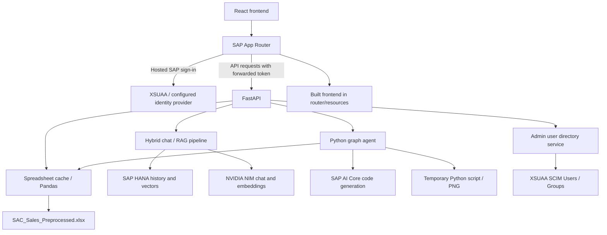

# System Architecture

The platform combines a React application, Python FastAPI, spreadsheet analytics, SAP HANA persistence/vector search, NVIDIA NIM chat and embeddings, and SAP AI Core graph code generation.

## Components

| Component | Implementation |
| --- | --- |
| Frontend | React 19, TypeScript, Vite 8, Tailwind CSS 4, Motion, Lucide, Axios, and sanitized Markdown |
| UI structure | `frontend/src/App.tsx`, `screens/`, `components/`, and `services/` |
| App Router | `router/server.js`, `router/xs-app.json`; static assets and authenticated API forwarding |
| Backend | `backend/api/app.py`; routers, models, services, RAG pipeline, database clients |
| Dataset | `excel_dataset_service.py` and `data_service.py`; spreadsheet loading/caching |
| AI | `ai_core_service.py`; NVIDIA completions/embeddings and SAP AI Core graph code generation |
| Persistence | HANA sales/vector artifacts under `backend/db/` and runtime chat-history tables |
| Directory | `xsuaa_users_service.py`; Admin token validation and XSUAA SCIM reads |

## Request flow

Locally, Vite on port 3000 proxies API requests directly to FastAPI on port 8000 without creating an App Router session.

## Data and analytics

Dashboard and analytics use `backend/preprocessing/output/SAC_Sales_Preprocessed.xlsx`. Dataset resolution can fall back to the raw input spreadsheet. The Excel service tracks modification timestamps and checks freshness on requests, with defaults of 15 minutes for reload checks and 24 hours for the stale threshold.

Upload replaces the standard file and updates caches in the handling process. It does not insert sales rows or generate embeddings, despite the response field named `embeddings_generated`. Files and caches are local to each backend instance.

Analytics classifies dimensions, metrics, and filters and aggregates with Pandas. Generated HANA SQL is for display, referencing `NEOVATIC_DB.SALES_FACT`; the active route does not execute it. Empty aggregations can produce built-in example results, and SQL timing/determinism fields are illustrative.

HANA artifacts include `SALES_ANALYTICS` and `VECTOR_TABLE` with `REAL_VECTOR(1536)`. The NVIDIA embedding service truncates embeddings to 1536 dimensions. These artifacts are separate from the spreadsheet aggregation path and displayed SQL.

## Chat and graphs

The hybrid RAG pipeline handles conversational, analytical, and graph requests using intent classification, schema processing, retrieval, calculation, and generation. Ordinary chat returns JSON; streaming chat emits processing stages and tokens through server-sent events.

The history service initializes `CHAT_SESSIONS` and `CHAT_MESSAGES` on startup when HANA is available. It persists user/assistant messages and supplies recent context. Session reads and deletion check ownership against the resolved user identity.

The graph agent uses the dataset/query plan, requests Python code from SAP AI Core, and supports deterministic fallback rendering. Temporary scripts execute in subprocesses with a 60-second timeout per execution and cleanup afterward. Responses include PNG data and optional insights, counts, and freshness metadata. These subprocesses are not a separate operating-system security sandbox.

## Authentication and user management

The deployed router authenticates static application routes with XSUAA and requires Member or Admin scope for API requests. The frontend restores the profile through `/api/auth/me` using its router session. Router `/logout` ends that session and opens the public signed-out page.

Backend profile/chat identity helpers currently decode JWT claims without signature verification; several data routes have no independent authentication dependency. Their deployed access boundary is the router. Chat identity also supports header/body/local fallback identifiers.

The user directory separately validates application tokens with `sap-xssec` and requires Admin scope. It forwards the administrator token to XSUAA SCIM, resolves group IDs when necessary, and filters users to direct project Member/Administrator assignments. It uses the existing application binding. See [deployment](deployment.md) for directory-reader permissions.

## Deployment shape

The current [MTA manifest](../mta.yaml) defines router, Python API, and frontend build modules. UI assets are copied into `router/resources/`. Managed resources are XSUAA, Destination, and an HDI container. The manifest has no HTML5 repository module, database deployer, AI Core binding, or provisioned autoscaler.

Preprocessing input/output files are excluded from the API package. Supply data after deployment. Files uploaded to Cloud Foundry instance storage are not durable/shared across restarts, restaging, or multiple instances. HANA chat persistence separately depends on connectivity and table privileges.

Related guides: [setup](setup.md), [API](api.md), [deployment](deployment.md).
